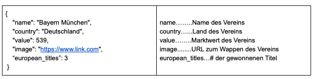
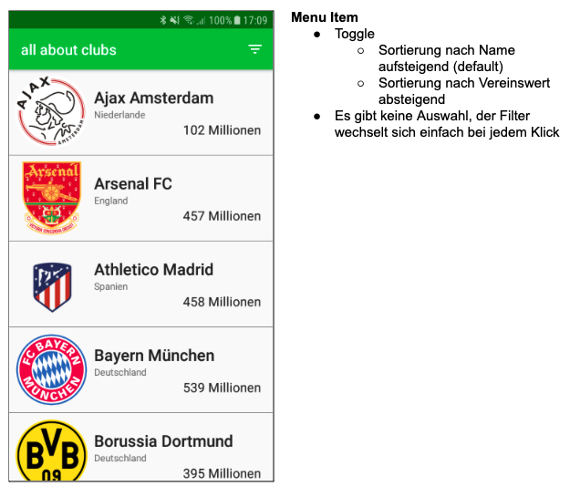
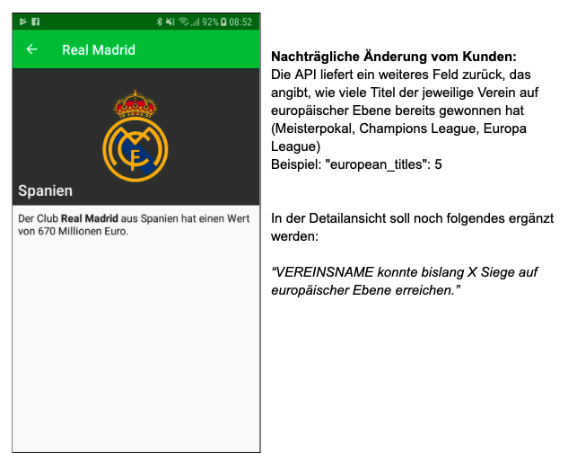

# Anforderungen -> Umsetzung

- Android 6.0 -> minSdkVersion: 23
- iOS 12.0+ -> Podfile?
- Hauptfarbe: #01C13B -> primarySwatch / ThemeData.ColorScheme
- Lokalisierung:
  - XCode > Project > Info > Localizations > Sprache auf Deutsch stellen
  - Library: i18n_extension
  - Vorbereitung für die Unterstützung von Englisch und Polnisch:
    - XCode > Project > Info > Localizations > Englisch und Polen hinzufügen? -> Nein, weil die Übersetzungen ja noch nicht vorliegen
- Design einhalten
- Api: https://public.allaboutapps.at/hiring/clubs.json -> Dio Library
- User Experience:
  - korrekte Fehlerbehandlung -> try/catch beim Api Request, AlertDialog bei Fehler, evtl. interface zum Übertragen des Fehlers an Logging-Server
  - Navigation: ausschließlich Named-Routes (Vorbereitung für Web-Version der App) -> eigene onRouteGenerated verwenden (von anderem Projekt)
  - Api-Requests sollten gecached werden, falls keine Internetverbindung besteht -> Package dio_cache_interceptor
- App sollte in Zukunft auch für andere Märkte genutzt werden:
  - einzige Änderung: andere Web-Schnittstelle, andere Farben -> evtl. Dart-Package der App: 1 Widget, nimmt Web-Schnittstelle und Farben entgegen, returnt MaterialApp
  - evtl. go Binary, die Projekt kopiert und anhand von Parametern an den neuen Markt anpasst

## Api



## Design

### Vereine Listenansicht

- Route: /
- Stream: List<Club>
- initState: getClubsFromApi() -> Stream
- StreamBuilder > ListView
- Toggle ->



### Vereine Detailansicht

- Route: /club/:id
- FutureBuilder



# Lösung

## App

im Ordner "clubs", normale Flutter-App nach Anforderungen

## Library

im Ordner "clubs_preset" habe ich dann auf Basis der App eine Library erstellt, bei der man mittels App-Config die Farben sowie die Url der Web-Schnittstelle ändern kann.

im Ordner "clubs_preset_demo" findet man eine Demo einer App, die nun die Library demonstriert.

main.dart

```dart
void main() async {
  runApp(
    ClubsApp(
      appConfig: AppConfig(
        baseUrl: "https://public.allaboutapps.at/hiring",
        primaryColor: const Color(0xFFD83931),
      ),
    ),
  );
}
```

## Go-Binary

beim Brainstorming in Anforderungen -> Umsetzung habe ich noch mit dem Gedanken gespielt, eine Go-Binary zu erstellen, die die App für einen anderen Markt klont, dies schien mir aber nicht mehr sinnvoll, weil das Klonen einerseits mit der Library eh fast genausoschnell geht bzw. man beim Klonen der App wahrscheinlich sowieso auch noch viele andere Parameter wie bundle id, app identifier, app name usw. ändert, was dann mehr Zeit in Anspruch nimmt als das Klonen der App selbst.

# Probleme/Schwierigkeiten

Die einzige Schwierigkeit an die ich jetzt denken könnte war das Cachen der Api-Requests, weil ich das in der Form das erste Mal gemacht habe, viel Zeit habe ich dafür allerdings auch nicht aufgewandt, weil ich schon beim Brainstorming/Konzept die Library gefunden habe.

# Zeitaufwand

Der Zeitaufwand lässt sich aus den Git-Commits ableiten, beträgt also rund 5 Stunden.
