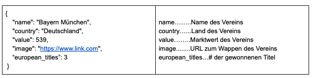
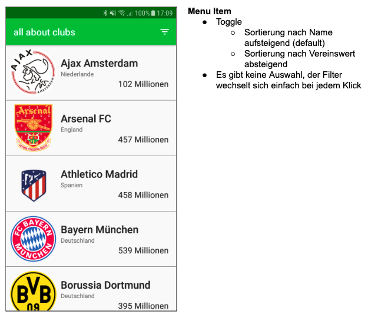
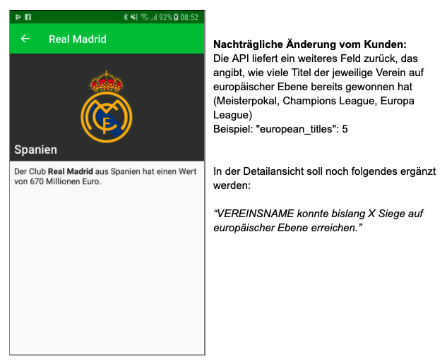

# Anforderungen -> Umsetzung

- Android 6.0 -> minSdkVersion: 23
- iOS 12.0+ -> Podfile?
- Hauptfarbe: #01C13B -> primarySwatch / ThemeData.ColorScheme
- Lokalisierung:
  - XCode > Project > Info > Localizations > Sprache auf Deutsch stellen
  - Library: i18n_extension
  - Vorbereitung für die Unterstützung von Englisch und Polnisch:
    - XCode > Project > Info > Localizations > Englisch und Polen hinzufügen? -> Nein, weil die Übersetzungen ja noch nicht vorliegen
- Design einhalten
- Api: https://public.allaboutapps.at/hiring/clubs.json -> Dio Library
- User Experience:
  - korrekte Fehlerbehandlung -> try/catch beim Api Request, AlertDialog bei Fehler, evtl. interface zum Übertragen des Fehlers an Logging-Server
  - Navigation: ausschließlich Named-Routes (Vorbereitung für Web-Version der App) -> eigene onRouteGenerated verwenden (von anderem Projekt)
  - Api-Requests sollten gecached werden, falls keine Internetverbindung besteht -> Package dio_cache_interceptor
- App sollte in Zukunft auch für andere Märkte genutzt werden:
  - einzige Änderung: andere Web-Schnittstelle, andere Farben -> evtl. Dart-Package der App: 1 Widget, nimmt Web-Schnittstelle und Farben entgegen, returnt MaterialApp
  - evtl. go Binary, die Projekt kopiert und anhand von Parametern an den neuen Markt anpasst

## Api

## Design

### Vereine Listenansicht

- Route: /
- Stream: List<Club>
- initState: getClubsFromApi() -> Stream
- StreamBuilder > ListView
- Toggle ->

### Vereine Detailansicht

- Route: /club/:id
- FutureBuilder

